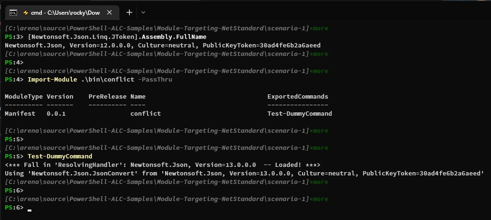

## Scenario 1

Basically, the registration of the `AssemblyResolve` event needs to happen before the first loading request of `Newtonsoft.Json.dll` gets triggered by the `conflict.dll` assembly.

In this scenario, the dependency of `Newtonsoft.Json.dll` is delay-loaded when the `Test-DummyCommand` is invoked.
So, the registration of the `AssemblyResolve` event can be done in the same assembly, on module importing.

### Build

To build the sample module, run `build.ps1`.
The module folder `conflict` will be deployed to `.\bin\conflict`.

### Run in PowerShell 7.0.x

PowerShell 7.0.x loads the version `12.0.0.0` of `Newtonsoft.Json` upon startup.
The `conflict` module depends on the version `13.0.0.0` of `Newtonsoft.Json`.

By leveraging `AppDomain.AssemblyResolve` and `Assembly.LoadFile`,
the `conflict` module can work as expected in PowerShell 7.0.x.

