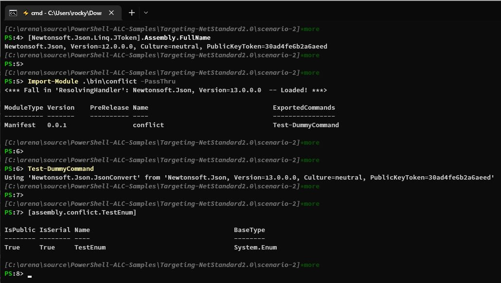

## Scenario 2

In this scenario, `Newtonsoft.Json` types are directly used in the class level, such as attribute and base type.
This will trigger the loading of the version `13.0.0.0` of `Newtonsoft.Json` as soon as the `conflict.dll` assembly gets loaded.
In that case, registrering `AssemblyResolve` within the same assembly will be too late and thus won't work.

In this case, the registration of `AssemblyResolve` needs to happen in a separate assembly (`resolver.dll` in this sample),
which needs to be loaded before the above assembly, so the handler can kick in when the `conflict.dll` assembly gets loaded.

### Build

To build the sample module, run `build.ps1`.
The module folder `conflict` will be deployed to `.\bin\conflict`.

### Run in PowerShell 7.0.x

PowerShell 7.0.x loads the version `12.0.0.0` of `Newtonsoft.Json` upon startup.
The `conflict` module depends on the version `13.0.0.0` of `Newtonsoft.Json`.

By leveraging `AppDomain.AssemblyResolve` and `Assembly.LoadFile`,
the `conflict` module can work as expected in PowerShell 7.0.x.

